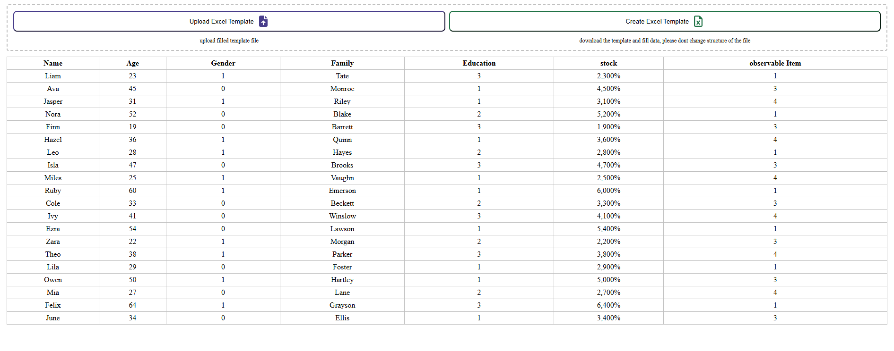

# Excel File Handler Component

This Angular component, `ExcelFileHandlerComponent`, provides an interface for downloading and uploading customized Excel templates with configurable headers and data types. It supports options for text, number, drop-down, and percentage columns, and integrates a preloader for actions with loading states.

## Features

- **Download Customized Excel Template**: Define headers, data types, and validation for generated templates.
- **Upload and Validate Excel Files**: Process uploaded files and validate data based on specified headers.
- **Loading Indicators**: Show preloader spinners during download and upload actions.
- **Dynamic Tooltips**: Customize tooltips for user guidance.

## Demo

 <!-- Add a screenshot here if available -->

## Installation

1. Clone the repository:
    ```bash
    git clone https://github.com/alimirdeveloper/ng-excel-file-handler.git
    ```
2. Navigate into the project directory:
    ```bash
    cd excel-file-handler-component
    ```
3. Install dependencies:
    ```bash
    npm install
    ```

## Usage

Import and configure the component in your Angular project.

### Inputs
- **templateName**: `string` – The name of the Excel template.
- **sheetName**: `string` – The name of the Excel sheet.
- **headers**: `ExcelColumn[]` – Array defining columns, each with:
    - `type`: `string` – Type of data (`text`, `number`, `drop-down`, or `percentage`).
    - `options` (optional): `Object` – Key-value pairs for dropdown values if type is `drop-down`.

### Outputs
- **onDataUploaded**: Event emitter that outputs processed data from uploaded files.

### Example

In your parent component template:

```html
<excel-file-handler
    [templateName]="'MyTemplate'"
    [sheetName]="'DataSheet'"
    [headers]="[
        { name: 'Name', type: 'text' },
        { name: 'Age', type: 'number' },
        { name: 'Country', type: 'drop-down', options: { US: 'United States', CA: 'Canada' } }
    ]"
    (onDataUploaded)="handleUploadedData($event)">
</excel-file-handler>
